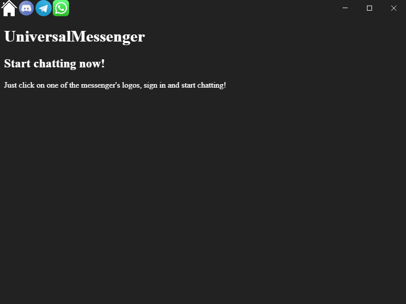
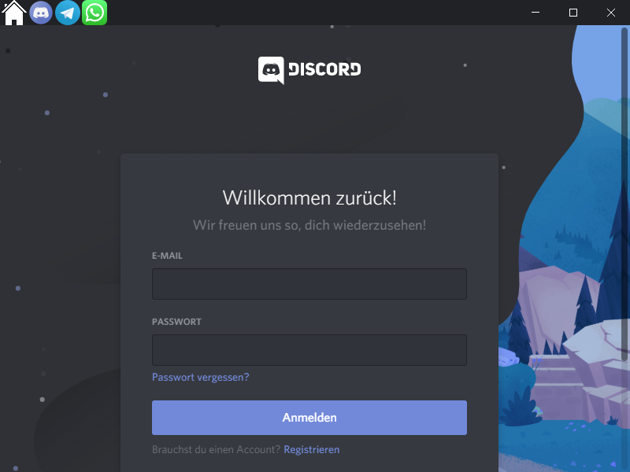

# UniversalMessenger
UniversalMessenger is a messenger application which supports multiple messengers like WhatsApp, Telegram and Discord.
Thanks to a modular design it can be extended very easily.

## Screenshots

## Building
For building UniversalManager, a Node.js installation is needed.
Dependencies can be installed using `npm install`.
To start UniversalManager type `npm start`.
